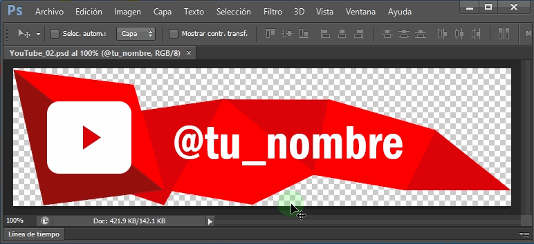

# 1. Animaciones YouTube

## 1.1. Etiquetas para tu nombre

------

- Formato: PSD (Photoshop)
- Peso: 327 KB
- Tamaño: 908 x 160 píxeles
- Descarga: [YouTube_01.psd](https://github.com/EdePC/lowerthirds/raw/master/YouTube_01.psd)
- Realizado en Photoshop CS6 con únicamente vectores

------

- Formato: PSD (Photoshop)
- Peso: 203 KB
- Tamaño: 720 x 200 píxeles
- Descarga: [YouTube_02.psd](https://github.com/EdePC/lowerthirds/raw/master/YouTube_02.psd)
- Realizado en Photoshop CS6 con únicamente vectores

------

## 1.2. Botones de Like, Suscribirse y Notificaciones

---

- Formato: PSD (Photoshop)
- Peso: 185 KB
- Tamaño: 792 x 200 píxeles
- Descarga: [YouTube_03.psd](https://github.com/EdePC/lowerthirds/raw/master/YouTube_03.psd)
- Realizado en Photoshop CS6 con únicamente vectores

# 2. Animaciones Instagram

## 1.1. Etiquetas para tu nombre

---

- Formato: PSD (Photoshop)
- Peso: 610 KB
- Tamaño: 717 x 201 píxeles
- Descarga: [Instagram_01.psd](https://github.com/EdePC/lowerthirds/raw/master/Instagram_01.psd)
- Realizado en Photoshop CS6 con únicamente vectores

------

# Todavía trabajando en nuevos formatos y más...

------

# 3. TUTORIALES

## 3.1. PSD a MOV con transparencia

### - Convierte los .PSD a Video fácilmente

Sigue los pasos del siguiente tutorial para convertir los formatos Photoshop .PSD descargados a formato de Video .MOV con transparencia. Luego podrás importarlos a tu editor de video favorito, o a cualquier otro software que importe videos .MOV como OBS, Adobe Afer Effects, Adobe Premier, etc

[Convierte los .PSD a video fácilmente](tutorials/)

## 3.2. Basados en Vectores Re-Escalables

### - Puedes escalar (ampliar o reducir) sin perder calidad

Se puede escalar sin perder calidad. Ejemplo de escala a 8K:

Recomiendo ajustar la escala directamente en el Photoshop antes de crear el video para evitar en lo menor posible re-escalar el video y perder calidad, claro que siempre se puede re-escalar un poquito para hacer ajustes, en este caso mejor crear el video un poco más grande para siempre evitar ampliar, ya que es preferible ampliar que reducir.

# Dudas, preguntas y sugerencias

Click en el siguiente enlace para dejar tus dudas, preguntas y sugerencias

[https://github.com/EdePC/lowerthirds/issues](https://github.com/EdePC/lowerthirds/issues)

# Donaciones

[paypal.me/edepe](https://paypal.me/edepe)
