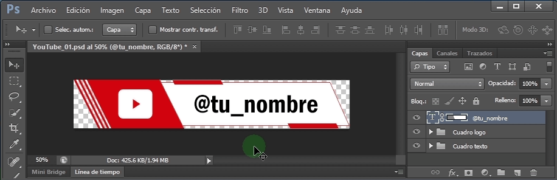
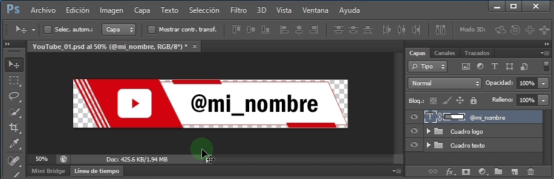
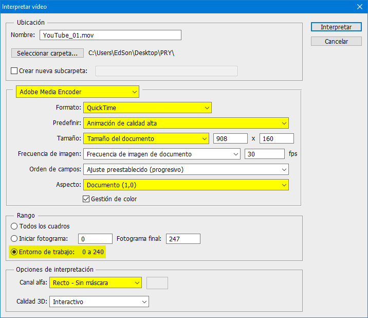

## Animaciones YouTube

- Formato: PSD (Photoshop)
- Peso: 327 KB
- Tamaño: 908 x 160 píxeles
- Descarga: [YouTube_01.psd](https://github.com/EdePC/lowerthirds/raw/master/YouTube_01.psd)
- Realizado en Photoshop CS6 con únicamente vectores

#### Todavía trabajando en nuevos formatos y más...

## PSD a MOV con transparencia

### Requisitos

1. Adobe Photoshop CS6 o superior
2. QuickTime: [https://support.apple.com/es_ES/downloads/quicktime](https://support.apple.com/es_ES/downloads/quicktime)

### Pasos

1. Descargar el .PSD y abrirlo en Photoshop

2. Editar el texto que interese

   

   - Doble click en la capa de texto
   - Editar el texto
   - Aceptar el cambio

3. Archivo > Exportar > Interpretar video

   

4. Elige la configuración resaltada y click en el botón Interpretar

   

   5. Importa tu video y disfrútalo

### Donaciones
[paypal.me/edepe](https://paypal.me/edepe)
