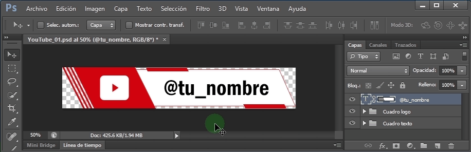
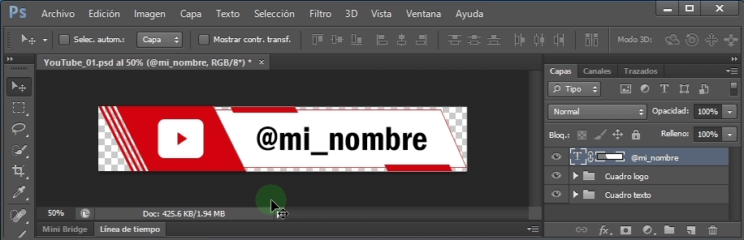
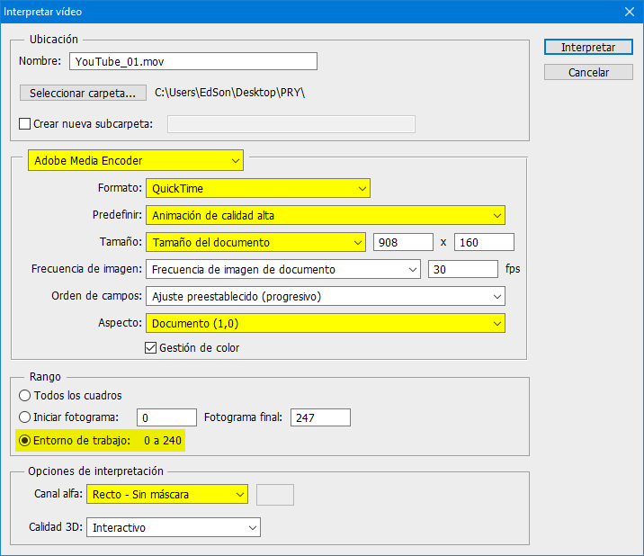

# Convierte los PSD a Video fácilmente

## Requisitos

1. Adobe Photoshop CS6 o superior
2. QuickTime: [https://support.apple.com/es_ES/downloads/quicktime](https://support.apple.com/es_ES/downloads/quicktime)

## Pasos

1. Descargar el .PSD y abrirlo en Photoshop

2. Editar el texto que interese

   - Doble click en la capa de texto
   - Editar el texto
   - Aceptar el cambio

   

3. Archivo > Exportar > Interpretar video

   

4. Elige la configuración resaltada y click en el botón Interpretar

   

5. Importa tu video en tu editor de video, software streaming, OBS, etc